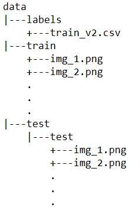

# Understanding Amazon Forests

### Table of Contents

- [Project Motivation](#motivation)
- [Project Components](#components)
  - [Multi Label Generator](#mlb)
  - [Multi Label Splitting](#mls)
  - [Deep Neural Net](#dnn)
- [Usage](#usage)
- [Contribute](#contribute)
- [Acknowledgement](#ack)

***

<a id='motivation'></a>

## 1. Project Motivation

Every minute, the world loses an area of forest the size of 48 football fields. And deforestation in the Amazon Basin accounts for the largest share, contributing to reduced biodiversity, habitat loss, climate change, and other devastating effects. But better data about the location of deforestation and human encroachment on forests can help governments and local stakeholders respond more quickly and effectively. So, I've tried to label satellite image chips with atmospheric conditions and various classes of land cover/land use. Resulting algorithms will help the global community better understand where, how, and why deforestation happens all over the world - and ultimately how to respond.

<a id='components'></a>

## 2. Project Components

There are three components in this project:

<a id='mlb'></a>

### 2.1. Multi Label Generator

Out of the box, Keras does not have a image generator that handles multi-label data! As a result, I've created a file `MLB.py` that solves this insufficiency of Keras by using its code as base and adding multi-label functionality on top of it so that data can be fed to the deep neural network via a generator (storing all the pixel values in a numpy array is very memory intensive and can cause system crashes due to lack of RAM).

<a id='mls'></a>

### 2.2. Multi Label Splitting

Out of the box, scikit-learn does not provide support to effectively split multi-label data into train and test. Thankfully, a library called `skmultilearn` solves it for us! This splits the data into train and test so that the testing data has all the labels that were present in the training data and the percentage of labels in both of these is proportional.

<a id='dnn'></a>

### 2.3. Deep Neural Net

Coming to the deep neutral network being used, I've gone with the quite basic `VGG16` that develops a very strong baseline to work with. It is not computationally expensive and gets the job done. Transfer learning is used with the pre-trained model (imagenet weights). Finally the f-beta score (beta=2) is used as an evaluation metric.

***

<a name="usage"/>

## Usage

<a id='local'></a>

The entire notebook was run on Google's servers using Google [colab](https://colab.research.google.com). You too can run this code there by uploading the data to Google Drive. Make sure to have your data in the following structure: <br>


***

<a name="contribute"/>

## Contribute
1.  Fork the repository from Github
2.  Clone your fork

`git clone https://github.com/kaustubh-ai/Automatic_Door_Unlocker.git`

3.  Add the main repository as a remote

```git remote add upstream https://github.com/kaustubh-ai/Automatic_Door_Unlocker.git```

4.  Create a pull request!

***

<a id='ack'></a>

## Acknowledgement
A very big thanks to Kaggle for this [data](https://www.kaggle.com/c/planet-understanding-the-amazon-from-space/data)!
